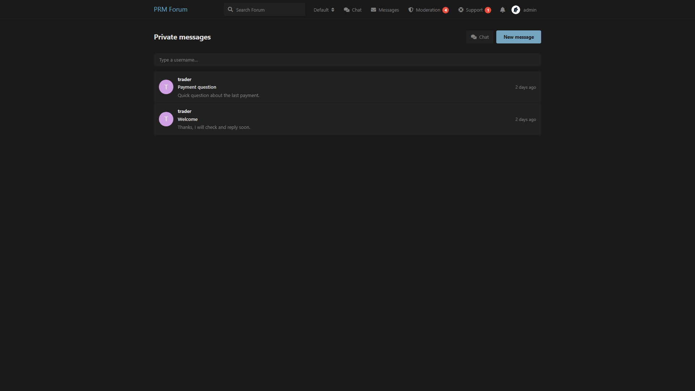
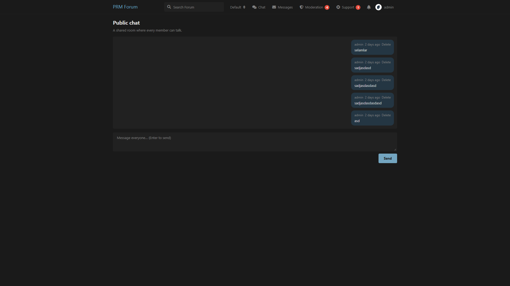

# Private Messages

Private 1:1 conversations between members, plus an optional public chat room.

Compatible with **Flarum 1.8**.

## Screenshots

Inbox:



Public chat:



## What it does

- Send a **new conversation** from a user’s **Options → Send message**
- Inbox with unread counts in the header
- Optional **public chat** (`/chat`) that every member can use
- Notifications when someone messages you

Starting a new DM with the same user always opens a **new** conversation. Replying inside an existing thread stays in that thread.

## Install

```bash
composer config repositories.prm-messages vcs https://github.com/smmpanelscripts1/prm-messages
composer require prm/messages:dev-main
```

Enable **Private Messages**, then:

```bash
php flarum migrate
php flarum cache:clear
```

## How to use

### Private messages

1. Admin → Permissions → enable **Send private messages** for the groups you want
2. Open a user → **Options → Send message**, or use **Messages** in the header
3. Search a username, write a subject (optional) and send

### Public chat

1. Admin → Private Messages → turn **Public chat** on
2. Members use **Chat** in the header

When public chat is off, the page and menu item are hidden.

## License

MIT
